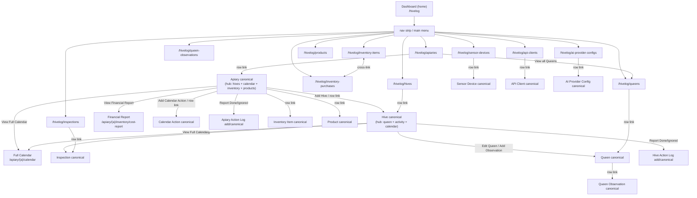

# HiveLog — Navigation Structure & Page Layout

A reference map of every user-facing page in the module: how it is reached,
what it contains, and the shared layout patterns each page is assembled
from.

Sources: `hivelog.routing.yml`, `hivelog.links.menu.yml`, `hivelog.api.php`,
`src/HivelogAppNavBuilder.php`, `src/Plugin/Derivative/HivelogMenuLinks.php`,
`src/HivelogEntityHierarchy.php`, `src/Controller/*`,
`src/*ListBuilder.php`, `src/Breadcrumb/HivelogBreadcrumbBuilder.php`,
`src/Entity/*` link templates, and the three submodules' own routing/
controller files. `hivelog.links.task.yml` and `hivelog.links.action.yml`
no longer exist — task 0118 retired local tasks and actions entirely in
favour of page-owned buttons everywhere.

---

## 1. Entry points & menu tree

`/hivelog` is the **dashboard** (`hivelog.dashboard`,
`DashboardController::view()`), not the apiary collection — that moved to
`/hivelog/apiaries` under [[0057-dashboard-information-architecture]]. Two
separate, parallel entry points now exist, both built from the same
registry (`HivelogAppNavBuilder::getAllItems()`, task 0119):

- **Main menu** (`main`, front-end), one child link per registry item,
  derived by `Drupal\hivelog\Plugin\Derivative\HivelogMenuLinks` off a
  single hand-written `hivelog.admin` parent (`/hivelog`, weight 10):

  ```
  main menu
  └── HiveLog                /hivelog                       (hivelog.dashboard)
      ├── Apiaries           /hivelog/apiaries               (entity.apiary.collection)
      ├── Hives              /hivelog/hives                  (entity.hive.collection)
      ├── Inspections        /hivelog/inspections            (entity.hive_inspection.collection)
      ├── Queens             /hivelog/queens                 (entity.queen.collection)
      ├── Queen Observations /hivelog/queen-observations     (entity.queen_observation.collection)
      ├── Inventory Items    /hivelog/inventory-items        (entity.inventory_item.collection)
      ├── Inventory Purchases /hivelog/inventory-purchases   (entity.inventory_purchase.collection)
      ├── Products           /hivelog/products                (entity.product.collection)
      ├── API Clients        /hivelog/api-clients             (entity.api_client.collection)
      ├── AI Provider Configs /hivelog/ai-provider-configs    (entity.ai_provider_config.collection)
      └── Sensor Devices     /hivelog/sensor-devices          (entity.sensor_device.collection)
  ```

  A submodule contributes a menu entry purely by implementing
  `hook_hivelog_app_nav_items()` (`hivelog.api.php`) — it no longer ships
  its own `<module>.links.menu.yml`.

- **In-app nav strip** (`HivelogAppNavBuilder::build()`, task 0105,
  injected into `page.content` via `hivelog_preprocess_page()` on every
  `/hivelog...` path — not a placed block). Same 11 items as the menu,
  plus a strip-only **Dashboard** entry first (deliberately not in the
  menu — `hivelog.admin` already points there, so a menu child would be
  redundant). Task 0120 adds:
  - **Groups**, separated by a decorative divider: `records` (Apiaries →
    Queen Observations), `inventory` (Inventory Items → Products),
    `setup` (API Clients, AI Provider Configs, Sensor Devices).
  - **Active-section marking** (`is-active` / `aria-current`) — exact
    match (`"page"`) when an item's own route is the current one, or
    same-section match (`"true"`) when the current route's *subject*
    entity (`HivelogEntityHierarchy::resolveSubject()` — the same
    resolution the breadcrumb trail uses, §5) is of the type an item
    names as its `section`. Two per-apiary report routes are
    deliberately excluded from section matching (`hivelog.apiary.inventory_cost_report`,
    `hivelog.apiary.calendar_action.collection`) — a report isn't
    conceptually part of "manage apiaries".

Per `AGENTS.md`, both live in/alongside the site's front-end **`main`**
menu context, not Structure — Drupal's core Local Actions block and deep
menu-block rendering are still not guaranteed, which is why list builders
draw their own headings/buttons (see §4) and the nav strip exists as a
theme-independent fallback in the first place.

### Not in either entry point (reachable only by direct URL or in-page link)

| Page | Route | Linked from |
|---|---|---|
| `/hivelog/hive-action-logs` | `entity.hive_action_log.collection` | **nowhere** |
| `/hivelog/apiary-action-logs` | `entity.apiary_action_log.collection` | **nowhere** |
| `/hivelog/calendar-actions` | `entity.calendar_action.collection` | dashboard stat tile; its own filter form |
| `/hivelog/apiaries/financial-report` | `hivelog.apiaries.financial_report` | dashboard stat tile (0 or 2+ apiaries); the per-apiary report |
| `hivelog.apiary.calendar_action.collection` | `/hivelog/apiary/{apiary}/calendar` | "View Full Calendar" button on apiary & hive pages |
| `hivelog.apiary.inventory_cost_report` | `/hivelog/apiary/{apiary}/inventory/cost-report` | "View Financial Report" button on apiary page |

This is a known, tracked gap, not an oversight — see
[[0121-reachability-of-orphaned-collection-pages]] (`backlog`, needs a
product decision per page: add to the nav strip, link from a more natural
parent page, or drop the route).

---

## 2. URL structure

All paths are under the `/hivelog/` prefix (the breadcrumb builder's
`applies()` depends on this — see §5).

Two routing patterns (per `AGENTS.md`):

- **Standard entity CRUD** — `entity.<id>.collection` / `.canonical` /
  `.add_form` / `.edit_form` / `.delete_form`.
- **Scoped-add routes** — path carries the parent, so the child form
  pre-populates the parent reference. Always link to these for children:
  - `hivelog.hive.add` → `/hivelog/apiary/{apiary}/hive/add`
  - `hivelog.inspection.add` → `/hivelog/hive/{hive}/inspection/add`
  - `hivelog.queen.add` → `/hivelog/hive/{hive}/queen/add`
  - `hivelog.queen_observation.add` → `/hivelog/queen/{queen}/observation/add`
  - `hivelog.calendar_action.add` → `/hivelog/apiary/{apiary}/calendar-action/add`
  - `hivelog.hive_action_log.add` → `/hivelog/hive/{hive}/calendar-action/{calendar_action}/log/add`
  - `hivelog.apiary_action_log.add` → `/hivelog/apiary/{apiary}/calendar-action/{calendar_action}/log/add`
  - `hivelog.inventory_item.add` / `hivelog.inventory_purchase.add` /
    `hivelog.product.add` → `/hivelog/apiary/{apiary}/…/add`
  - `nanoprobe.sensor_device.add_for_hive` / `_apiary` →
    `/hivelog/hive/{hive}/sensor-device/add` /
    `/hivelog/apiary/{apiary}/sensor-device/add`

Submodule entities follow the same standard-CRUD pattern under their own
path segment: `/hivelog/sensor-device/{id}`, `/hivelog/api-client/{id}`,
`/hivelog/ai-provider-config/{id}`, each with `/edit` and `/delete`
siblings. `entity.sensor_device.add_form` /
`entity.api_client.add_form` / `entity.ai_provider_config.add_form` are
`administer hivelog`-only (no parent context in the URL to scope a
narrower permission against); ApiClient and AiProviderConfig have no
scoped add route at all (site-level credentials, not apiary/hive-scoped).

### Entity → link-template coverage

| Entity | collection | canonical | add-form | edit | delete |
|---|:-:|:-:|:-:|:-:|:-:|
| Apiary | ✅ `/hivelog/apiaries` | ✅ (custom ctrl) | ✅ | ✅ | ✅ |
| Hive | ✅ | ✅ (custom ctrl) | scoped only | ✅ | ✅ |
| Hive Inspection | ✅ | ✅ (custom ctrl) | scoped only | ✅ | ✅ |
| Queen | ✅ | ✅ (custom ctrl) | ✅ + scoped | ✅ | ✅ |
| Queen Observation | ✅ | ✅ (custom ctrl) | scoped only | ✅ | ✅ |
| Calendar Action | ✅ | ✅ (custom ctrl) | scoped only | ✅ | ✅ |
| Hive Action Log | ✅ | ✅ (custom ctrl) | scoped only | ✅ | ✅ |
| Apiary Action Log | ✅ | ✅ (custom ctrl) | scoped only | ✅ | ✅ |
| Inventory Item | ✅ | ✅ (custom ctrl) | ✅ + scoped | ✅ | ✅ |
| Inventory Purchase | ✅ | ✅ (custom ctrl) | ✅ + scoped | ✅ | ✅ |
| Product | ✅ | ✅ (custom ctrl) | ✅ + scoped | ✅ | ✅ |
| Sensor Device | ✅ | ✅ (custom ctrl) | site-wide + scoped | ✅ | ✅ |
| API Client | ✅ | ✅ (custom ctrl) | site-wide only | ✅ | ✅ |
| AI Provider Config | ✅ | ✅ (custom ctrl) | site-wide only | ✅ | ✅ |
| Calendar Action Item Requirement — managed inline on Calendar Action page | — | — | scoped only | ✅ | ✅ |
| Calendar Action Product Yield — managed inline on Calendar Action page | — | — | scoped only | ✅ | ✅ |
| Harvest Yield / Inventory Usage — auto-created when an action log is "done" | — | — | — | — | — |

**Every canonical page above now owns its Edit / Delete as a page-rendered
button group** (task 0118 — `HivelogEntityActionsTrait::buildActions()`,
or transitively via `HivelogDetailPageTrait`, which uses it). There is no
longer any distinction between entity types that had a local-task tab and
those that didn't; the tabs and the two context-free "Add" local actions
(`hivelog.links.action.yml`) are both gone. `ApiaryListBuilder` and
`QueenListBuilder` still build their own "Add" heading directly for their
context-free add routes (`entity.apiary.add_form`, `entity.queen.add_form`)
— every other "Add" button is hand-built in a controller or list builder,
unchanged.

A canonical page's Delete button checks the plain `delete` access
operation, not `delete_route` — so it's hidden entirely when a
BLOCK-treatment child still references the entity (ADR-0103/task 0141),
even for `administer hivelog`. `delete_route` (defined on Apiary, Hive,
Queen, CalendarAction, InventoryItem and Product's access handlers) exists
only so a stale/bookmarked link to the delete form still renders that
form's own "Can't delete yet" explanation instead of a bare 403 — it does
not make the button itself reappear.

---

## 3. The landing & navigation pages

### 3.1 `/hivelog` — Dashboard (the home page)

`DashboardController::view()` ([[0057-dashboard-information-architecture]]).
Top to bottom:

| weight | Element | Notes |
|---:|---|---|
| −30 | **Subtitle** | "Apiary and hive logbook" |
| −10 | **Header** | current ISO-week badge + the CBR summary line (moved here from the old apiary-collection page) |
| 0 | **Welcome card** | shown *instead of* everything below when the user has no viewable apiaries — onboarding copy + Add Apiary |
| 0 | **Needs attention** | merged queue: overdue/due seasonal actions, low-stock items, submodule sensor alerts — omitted (replaced by the welcome card) when there are no apiaries |
| — | **Submodule dashboard sections** | e.g. nexus's AI Insights — `hook_hivelog_dashboard_sections()`, each section carries its own `#weight` |
| 10 | **Stat tiles** | Apiaries · Active hives · Inspections this month · Open seasonal tasks (+ overdue sublabel) · Low-stock items · Net YTD (only if the current user can see finances on at least one apiary) |
| 20 | **Split: Upcoming / Recent activity** | Upcoming — next four weeks of scheduled seasonal actions across all apiaries. Recent activity — latest inspections, queen observations, action logs, purchases, harvest yields |

Cache: `user` context (the CBR line and the whole apiary/finance
visibility filter are per-user); `max-age` = seconds until the sooner of
the next ISO-week boundary or the next midnight (several tiles/queues are
week- or date-relative).

### 3.2 `/hivelog/apiaries` — Apiary collection

`ApiaryListBuilder::render()`. Top to bottom:

| weight | Element | Notes |
|---:|---|---|
| −90 | **Heading row** | `<h2>Apiaries</h2>` + button-group: **Add Apiary** (primary), **View all Queens** |
| default | **Table** (`hivelog:entity-table` SDC) | Columns: CBR · Name (link) · Location (truncated 60ch) · Owner · Operations (Edit / Delete per-row access) |
| 10 | **Pager** | 20 per page |

This is the only cross-apiary "everything" view for apiaries. It does
**not** link out to Inspections, Inventory, Products, Calendar, or the
Financial Report — those are reached via the main menu / nav strip, or by
drilling into an apiary from here or from the dashboard.

### 3.3 Apiary canonical — `/hivelog/apiary/{apiary}` (the hub page)

`ApiaryController::view()`. This is the busiest page in the module — six
stacked sections, most following the same heading + filter + table + pager
rhythm:

| weight | Section | Heading actions | Table columns | Empty-state |
|---:|---|---|---|---|
| −10 | **Actions** | page-owned Edit / Delete button group (task 0118) | — | — |
| — | **Apiary fields** | (default entity view builder) | name, description, location, Leaflet map, notes | — |
| 10–13 | **Hives** | Add Hive (primary) | Name · Breed (from active queen) · Temperament · Status · Ops | "No hives…" / "No hives match the current filters." |
| 20–22 | **Seasonal Calendar** — heading shows *current ISO week* | View Full Calendar · Add Calendar Action (primary) | Title · Week(s) · Status (+ Due now/Overdue/Upcoming) · Week Completed · Notes · Ops (Report Done / Report Ignored, or View Log / Edit) | context-sensitive, via `calendarChecklistEmptyMessage()` |
| 21 | Calendar filter form | status (Unreported default) + year (prev/current/next) | | |
| 25–27 | **Inventory** | View Financial Report · Add Inventory Item (primary) · Add Purchase | Name · Category · Unit · Type · Stock on Hand (+ "Low Stock") · Status · Ops | "No inventory items…" |
| 30–32 | **Products** | Add Product (primary) | Name · Unit · Expected Unit Price · Status · Ops | "No products…" |

Only apiary-scoped calendar actions appear in the Seasonal Calendar table
here; hive-scoped ones are reported on each hive's page.

Cache: `url.query_args` + `user.permissions`; list tags for hive,
calendar_action, apiary_action_log, inventory_item, inventory_purchase,
inventory_usage, product; per-row entity dependencies; `max-age` =
seconds until the next ISO week (because the heading prints "current
week").

### 3.4 Hive canonical — `/hivelog/hive/{hive}`

`HiveController::view()`. Top to bottom:

| weight | Section | Notes |
|---:|---|---|
| −10 | **Actions** | page-owned Edit / Delete button group (task 0118) |
| 5 | **Hive fields** | default entity view builder |
| 7 | **Weight histogram** | letterboxed chart for the year of the most recent inspection; whole (unfiltered) inspection set; omitted if no data |
| 8 | **Queen section** | active queen card (or "No active queen…" + Add Queen) with Edit Queen; "View all Queens" link — no standalone history list on this page, `Queen::getQueens()` already aggregates every queen (active or retired) the hive has ever had onto the Queens collection instead |
| 9 | `<h2>Hive Activity</h2>` | shared banner over the next block |
| 10 | **Hive Activity** — two stacked full-width columns | **Inspections** (`buildInspectionsColumn()`, Add Inspection, filter, table, pager) and **Queen Observations** (`buildObservationsColumn()`, Add Observation, filter, table, pager) |
| 20 | **Images grid** | attached inspection photos; omitted if none |
| 25–27 | **Seasonal Calendar checklist** | heading shows current ISO week + View Full Calendar; filter (status/year); one row per *enabled* apiary calendar action cross-referenced against this hive's logs; Report Done / Report Ignored, or View Log / Edit / View Inspection |

Cache: `url.query_args` + `user.permissions`; list tags for
hive_inspection, queen, queen_observation, calendar_action,
hive_action_log; per-row dependencies; `max-age` = seconds to next ISO
week.

### 3.5 Full Calendar — `/hivelog/apiary/{apiary}/calendar`

`ApiaryController::fullCalendar()`. Reference/management view of **every**
calendar action for the apiary, both scopes. No status/report buttons
(reporting happens on the apiary or hive page).

- Heading: **Add Calendar Action** only (no title text — the route's `<h1>`
  already names the page).
- Filter form (`HivelogFullCalendarFilterForm`): includes an `enabled`
  filter defaulting to "Enabled only".
- Table columns: Title (link) · Scope (Hive/Apiary) · Week(s) · Category ·
  Enabled · Operations (Edit / Delete, with a `destination` query param so
  the forms return here instead of the apiary page).
- Pager, 1 element.

### 3.6 Financial Report — `/hivelog/apiary/{apiary}/inventory/cost-report`

`InventoryReportController::costReport()`.

- Year-selector button group (query `?year=`).
- **Summary** table: total consumable cost · total active depreciation ·
  total cost · total potential income · net.
- **Breakdown by item** table: Item (link) · Type (Consumable / Durable /
  Yield) · Quantity · Amount.
- Multi-year trend rows (`buildTrendRows()`).

A combined, all-apiaries version lives at
`hivelog.apiaries.financial_report`, `/hivelog/apiaries/financial-report`
— the dashboard's "Net YTD" tile target when more than one apiary is
visible.

### 3.7 Calendar Action canonical — `/hivelog/calendar-action/{calendar_action}`

`CalendarActionController::view()`. Page-owned Edit/Delete first, then the
action's `description` (with `- ` bullet support via `SimpleBulletText`)
plus two embedded, inline-managed "recipe" tables: **Required Items**
(`buildRequirementsSection()`) and **Expected Yield**
(`buildYieldSection()`), each with its own Add / Edit / Delete.

### 3.8 Other collection pages

All use the default `EntityListBuilder::render()` (plain `#type => table`,
no SDC, no self-built heading) **except** the four below, which build a
heading row for their context-free Add route:

| Page | Heading buttons |
|---|---|
| `/hivelog/queens` | Add Queen |
| `/hivelog/inventory-items` | Add Inventory Item · (link) Inventory Purchases |
| `/hivelog/inventory-purchases` | Add Purchase · (link) Inventory Items |
| `/hivelog/products` | Add Product |

`/hivelog/hives`, `/hivelog/inspections`, `/hivelog/queen-observations`,
`/hivelog/sensor-devices` and the three orphaned `*-action-log`/
`calendar-actions` collections have **no Add button by design** — those
entities always require a parent chosen via a scoped-add route (or, for
ApiClient/AiProviderConfig, are admin-provisioned via the site-wide add
form only), so there is nowhere context-free to add them from.

---

## 4. Shared layout patterns

Every list-style section on every page is assembled from the same parts:

1. **Heading row** — `<div class="hivelog-list-heading">` with a
   `__title` `<h2>` (task 0128 — every page-level section heading, list or
   otherwise, is H2; a nested sub-list under an H2 banner, like the Hive
   page's Inspections/Queen Observations columns, is H3) on the left and a
   `__action` child on the right (`justify-content: space-between`, so it
   is styled for **exactly two children**). When more than one action
   button is needed they are wrapped in a single `__action` container so
   the two-child rule still holds.
2. **Page-owned Actions button group** — `HivelogEntityActionsTrait::buildActions()`
   (task 0118), the sole source of Edit/Delete on every canonical page;
   see §2's coverage table for its access rules.
3. **Filter form** — a GET form (`HivelogHiveFilterForm`,
   `HivelogCalendarFilterForm`, `HivelogFullCalendarFilterForm`,
   inspection/observation filters) on its own row; its CSS right-aligns the
   Filter / Reset buttons. State lives in the query string → every page
   that has one declares the `url.query_args` cache context.
4. **Table** — the `hivelog:entity-table` SDC component
   (`headers`, `rows` as `{cells: […]}`, `empty_message`). Operations
   cells are pre-rendered with `renderer->renderInIsolation()`.
5. **Pager** — `#type => pager` with a dedicated `#element` index so
   multiple pagers on one page (apiary: hives + inventory + products)
   don't collide.
6. **Buttons** — the `hivelog:button` / `hivelog:button-group` SDC only
   (ADR-0012). Variants: `primary` (adds), `danger` (deletes), default
   (navigation). No framework/utility classes; `css/hivelog.buttons.css`
   is the sole source of truth.
7. **Cache discipline** (ADR-0009) — every custom controller ends by
   assembling `CacheableMetadata` explicitly: contexts, list cache tags
   for each embedded entity type, per-row entity dependencies, and (for
   the calendar/dashboard pages) a `max-age` that expires at the next ISO
   week or day boundary.

Weights are assigned in sparse bands (10s, 20s, 30s), with the Actions
button group at −10 so it always sits above the entity's own fields, so
new sections can be appended without renumbering — tests implicitly
depend on existing weights.

---

## 5. Breadcrumbs

`hivelog.breadcrumb` service (`HivelogBreadcrumbBuilder`, **priority
1004** — must outrank `easy_breadcrumb`'s 1003). Every trail starts:

```
Home  ›  HiveLog  ›  …
```

`HiveLog` links to `hivelog.dashboard` (`/hivelog`). `applies()` matches
**by path** (task 0067) — every route whose path is `/hivelog` or starts
with `/hivelog/`, minus an explicit exclusion list for non-page routes
(file-download endpoints etc.) — not by route-name prefix, so a new
`/hivelog/...` route is covered automatically with nothing to register.

The builder walks the entity hierarchy, not the URL path, via one
declarative map (`HivelogEntityHierarchy::PARENT_FIELD`, task 0116,
extracted from the builder in task 0127): entity type ID → the reference
field naming its parent. `resolveSubject()` (also on
`HivelogEntityHierarchy`, shared with the nav strip's active-section
resolution since task 0120) picks the one upcast route parameter the
trail is built from, then the builder walks `PARENT_FIELD` from there up
to the root, adding one crumb per ancestor:

- Inspection → `Home › HiveLog › {Apiary} › {Hive} › {Inspection}`
- Queen Observation → `… › {Apiary} › {Hive} › {Queen} › {Observation}`
- Hive Action Log → `… › {Apiary} › {Hive} › {Log}`
- Calendar Action → `… › {Apiary} › {Calendar Action}`

A missing reference (deleted apiary, unassigned queen) just stops the
walk, shortening the trail rather than breaking it. Three types with no
apiary/hive ancestor (`HivelogEntityHierarchy::COLLECTION_THREADED_TYPES`
— Sensor Device, API Client, AI Provider Config) thread through their own
collection link instead: `Home › HiveLog › {Collection} › {Entity}`.
Apiary itself, and a Queen with no hive, skip straight to
`Home › HiveLog › {Entity}` with no collection crumb — a known
inconsistency with the collection-threaded types above, not yet resolved
(see [[0122-top-level-entity-breadcrumb-threading]]).

Every trail ends with a crumb naming the current page (ADR-0102, task
0117): the entity's own label on a canonical page, "Edit" / "Delete" on
those forms, and the route's own title everywhere else (add forms, scoped
or site-wide, and any other bolt-on route under `/hivelog`) — so an edit,
delete or add page always has a clickable way back, which was
[[0117-breadcrumb-terminal-crumb-on-form-pages]]'s own fix for a real
bug (no such link existed before). Collection pages and the combined
report end with their own name as the terminal crumb instead, its label
read from each entity type's own `label_collection` (task 0119) rather
than a second hand-maintained copy. Named sub-pages that aren't a
canonical page (per-apiary report, full-calendar, Hive Insights, sensor
readings/config download, token regeneration) get their own short
terminal label via a small route → label map.

**Any new `/hivelog/...` route is covered automatically** by `applies()`
— only add it to the exclusion list if it's a non-page route (download
endpoint, AJAX callback). Adding a new entity type needs one
`PARENT_FIELD` (or `COLLECTION_THREADED_TYPES`) entry, not a new
`build()` block — see AGENTS.md "Services".

---

## 6. Navigation graph (how you move between pages)



Key point: the **only** paths to the Calendar, Financial Report, Inventory,
and Products features run **through an apiary**. The global menu items for
Inventory Items / Purchases / Products land on flat cross-apiary catalogs
with no way back to a specific apiary context.

---

## 7. Observations & gaps

Reconciled 2026-09-25 against the code as it stands after
[[0116-breadcrumb-builder-parent-map-refactor]] through
[[0120-app-nav-active-state-and-grouping]]. Resolved items are removed
rather than kept as dead history — see git history / the tasks named
below for the record of what changed.

1. **The apiary page is overloaded.** Six stacked sections (actions,
   hives, calendar, inventory, products, plus the entity fields and a
   map) on one route, three independent pagers, ~1,200+ lines of
   controller. Any redesign should consider splitting inventory/products/
   calendar onto their own per-apiary tabs. Unaddressed.

2. **Four collection/report pages have no way in from the nav strip or
   menu.** `/hivelog/calendar-actions`, `/hivelog/hive-action-logs`,
   `/hivelog/apiary-action-logs`, `/hivelog/apiaries/financial-report`
   (§1). Tracked, pending a per-page decision:
   [[0121-reachability-of-orphaned-collection-pages]].

3. **Top-level entities thread their breadcrumb inconsistently.** Sensor
   Device/API Client/AI Provider Config go through their own collection
   crumb; Apiary and a hive-less Queen don't (§5). Tracked, pending a
   decision: [[0122-top-level-entity-breadcrumb-threading]].

4. **Global catalogs are dead-ends.** The Inventory Items / Purchases /
   Products pages are cross-apiary and have no apiary column linking
   back, and no filter by apiary. From there the only way to an apiary
   context is the browser back button or the nav strip/menu.
   Unaddressed.

5. **Menu lives in the front-end `main` menu.** This is why list builders
   reimplement heading/add chrome and why core Local Actions can't be
   relied on (§1, §4) — the nav strip is the module's own answer to that,
   not a full fix. A future redesign could still decide deliberately
   whether to keep the menu tree in `main` or move it to an admin/section
   menu; it would affect breadcrumbs and block placement again.
   Unaddressed.

6. **"View Full Calendar" is the same target from two pages** (apiary and
   hive) but the surrounding context differs (apiary page also has "Add
   Calendar Action"; hive page doesn't). Minor, unaddressed.

7. **`entity-table` SDC is the only table primitive** and it has no
   built-in sort, column-hide, or responsive card mode beyond what
   `css/hivelog.tables.css` provides. A denser page may need the
   component extended rather than worked around. Unaddressed.

Resolved since the last version of this document (2026-09-07): no
landing page (fixed by [[0057-dashboard-information-architecture]]'s
dashboard, well before this refresh); inconsistent local-task tab
coverage (fixed outright by
[[0118-page-owned-edit-delete-then-retire-local-tasks]] retiring tabs
entirely in favour of uniform page-owned buttons); the breadcrumb
`applies()` note about a route-name-prefix rule (it was already
path-based by the time this refresh was written — corrected in §5, not a
code change).
