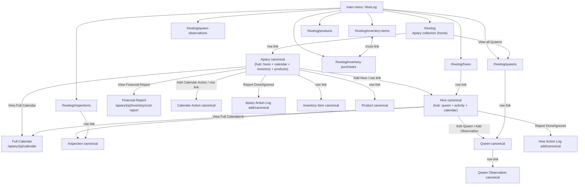

# HiveLog — Navigation Structure & Page Layout

A reference map of every user-facing page in the module: how it is reached,
what it contains, and the shared layout patterns each page is assembled
from. Written as the pre-work asset for an upcoming change to the
navigation and landing pages — the "Observations & gaps" section at the
end is the part most relevant to that change.

Sources: `hivelog.routing.yml`, `hivelog.links.menu.yml`,
`hivelog.links.task.yml`, `hivelog.links.action.yml`, `src/Controller/*`,
`src/*ListBuilder.php`, `src/Breadcrumb/HivelogBreadcrumbBuilder.php`,
`src/Entity/*` link templates.

---

## 1. Entry points & menu tree

The whole module hangs off a single main-menu item. There is **no
dashboard or landing screen other than the apiary collection** — `/hivelog`
*is* the home page.

```
main menu
└── HiveLog                     /hivelog                  (entity.apiary.collection)
    ├── Hives                   /hivelog/hives            (entity.hive.collection)
    ├── Inspections             /hivelog/inspections      (entity.hive_inspection.collection)
    ├── Queens                  /hivelog/queens           (entity.queen.collection)
    ├── Queen Observations      /hivelog/queen-observations (entity.queen_observation.collection)
    ├── Inventory Items         /hivelog/inventory-items  (entity.inventory_item.collection)
    ├── Inventory Purchases     /hivelog/inventory-purchases (entity.inventory_purchase.collection)
    └── Products                /hivelog/products         (entity.product.collection)
```

Menu link definitions live in `hivelog.links.menu.yml`; the parent item is
`hivelog.admin` (`menu_name: main`, weight 10), all others are its
children. Per `AGENTS.md`, the tree is placed in the site's **front-end
`main` menu**, not Structure — so Drupal's core Local Actions block and
deep menu-block rendering are not guaranteed to be present. That is why
list builders draw their own headings/buttons (see §4).

### Not in the menu (reachable only by direct URL or in-page link)

| Route | Path | Reached from |
|---|---|---|
| `entity.calendar_action.collection` | `/hivelog/calendar-actions` | nothing — orphaned |
| `entity.hive_action_log.collection` | `/hivelog/hive-action-logs` | nothing — orphaned |
| `entity.apiary_action_log.collection` | `/hivelog/apiary-action-logs` | nothing — orphaned |
| `hivelog.apiary.calendar_action.collection` | `/hivelog/apiary/{apiary}/calendar` | "View Full Calendar" button on apiary & hive pages |
| `hivelog.apiary.inventory_cost_report` | `/hivelog/apiary/{apiary}/inventory/cost-report` | "View Financial Report" button on apiary page |

The three `*-action-log` / `calendar-actions` collection routes have full
list builders but no link anywhere in the UI. The real calendar UI is the
per-apiary `…/calendar` page.

---

## 2. URL structure

All paths are under the `/hivelog/` prefix (the breadcrumb builder's
`applies()` and route-name prefixes depend on this — see §5).

Two routing patterns (per `AGENTS.md`):

- **Standard entity CRUD** — `entity.<id>.collection` / `.canonical` /
  `.add_form` / `.edit_form` / `.delete_form`.
- **Scoped-add routes** — path carries the parent, so the child form
  pre-populates the parent reference. Always link to these for children:
  - `hivelog.hive.add` → `/hivelog/apiary/{apiary}/hive/add`
  - `hivelog.inspection.add` → `/hivelog/hive/{hive}/inspection/add`
  - `hivelog.queen.add` → `/hivelog/hive/{hive}/queen/add`
  - `hivelog.queen_observation.add` → `/hivelog/queen/{queen}/observation/add`
  - `hivelog.calendar_action.add` → `/hivelog/apiary/{apiary}/calendar-action/add`
  - `hivelog.hive_action_log.add` → `/hivelog/hive/{hive}/calendar-action/{calendar_action}/log/add`
  - `hivelog.apiary_action_log.add` → `/hivelog/apiary/{apiary}/calendar-action/{calendar_action}/log/add`
  - `hivelog.inventory_item.add` / `hivelog.inventory_purchase.add` /
    `hivelog.product.add` → `/hivelog/apiary/{apiary}/…/add`

### Entity → link-template coverage

| Entity | collection | canonical | add-form | edit | delete | Local tasks (tabs) |
|---|:-:|:-:|:-:|:-:|:-:|:-:|
| Apiary | ✅ `/hivelog` | ✅ (custom ctrl) | ✅ | ✅ | ✅ | View / Edit / Delete |
| Hive | ✅ | ✅ (custom ctrl) | scoped only | ✅ | ✅ | View / Edit / Delete |
| Hive Inspection | ✅ | ✅ (custom ctrl) | scoped only | ✅ | ✅ | View / Edit / Delete |
| Queen | ✅ | ✅ (custom ctrl) | ✅ + scoped | ✅ | ✅ | View / Edit / Delete |
| Queen Observation | ✅ | ✅ (custom ctrl) | scoped only | ✅ | ✅ | View / Edit / Delete |
| Calendar Action | ✅ | ✅ (custom ctrl) | scoped only | ✅ | ✅ | **none** |
| Hive Action Log | ✅ | ✅ (custom ctrl) | scoped only | ✅ | ✅ | **none** |
| Apiary Action Log | ✅ | ✅ (custom ctrl) | scoped only | ✅ | ✅ | **none** |
| Inventory Item | ✅ | ✅ (custom ctrl) | ✅ + scoped | ✅ | ✅ | **none** |
| Inventory Purchase | ✅ | ✅ (custom ctrl) | ✅ + scoped | ✅ | ✅ | **none** |
| Product | ✅ | ✅ (custom ctrl) | ✅ + scoped | ✅ | ✅ | **none** |
| Calendar Action Item Requirement | — | — | scoped only | ✅ | ✅ | — (managed inline on Calendar Action page) |
| Calendar Action Product Yield | — | — | scoped only | ✅ | ✅ | — (managed inline on Calendar Action page) |
| Harvest Yield / Inventory Usage | — | — | — | — | — | — (auto-created when an action log is "done") |

Local tasks are defined in `hivelog.links.task.yml` for **only** the first
five entities. The six other canonical pages have no View/Edit/Delete tab
strip — they rely entirely on in-page buttons.

Standalone add-action links (`hivelog.links.action.yml`) exist for **only**
`entity.apiary.add_form` and `entity.queen.add_form`; every other "Add"
button is hand-built in a controller or list builder.

---

## 3. The landing & navigation pages

### 3.1 `/hivelog` — Apiary collection (the home page)

`ApiaryListBuilder::render()`. Top to bottom:

| weight | Element | Notes |
|---:|---|---|
| −100 | **CBR summary** container | "Your CBR number: …" / prompt to set one on profile / "Sign in to record…" — three states off the `cbr_number` user field |
| −90 | **Heading row** | `<h3>Apiaries</h3>` + button-group: **Add Apiary** (primary), **View all Queens** |
| default | **Table** (`hivelog:entity-table` SDC) | Columns: CBR · Name (link) · Location (truncated 60ch) · Owner · Operations (Edit / Delete per-row access) |
| 10 | **Pager** | 20 per page |

Cache: `user` context + current user dependency (CBR line is per-user).

This is the only cross-apiary "everything" view for apiaries. It does **not**
link out to Inspections, Inventory, Products, Calendar, or the Financial
Report — those are reached via the main menu or by drilling into an apiary.

### 3.2 Apiary canonical — `/hivelog/apiary/{apiary}` (the hub page)

`ApiaryController::view()`. This is the busiest page in the module — five
stacked sections, each following the same heading + filter + table + pager
rhythm:

| weight | Section | Heading actions | Table columns | Empty-state |
|---:|---|---|---|---|
| — | **Apiary fields** | (default entity view builder) | name, description, location, Leaflet map, notes | — |
| 10–13 | **Hives** | Add Hive (primary) | Name · Breed (from active queen) · Temperament · Status · Ops | "No hives…" / "No hives match the current filters." |
| 20–22 | **Seasonal Calendar** — heading shows *current ISO week* | View Full Calendar · Add Calendar Action (primary) | Title · Week(s) · Status (+ Due now/Overdue/Upcoming) · Week Completed · Notes · Ops (Report Done / Report Ignored, or View Log / Edit) | context-sensitive, via `calendarChecklistEmptyMessage()` |
| 21 | Calendar filter form | status (Unreported default) + year (prev/current/next) | | |
| 25–27 | **Inventory** | View Financial Report · Add Inventory Item (primary) · Add Purchase | Name · Category · Unit · Type · Stock on Hand (+ "Low Stock") · Status · Ops | "No inventory items…" |
| 30–32 | **Products** | Add Product (primary) | Name · Unit · Expected Unit Price · Status · Ops | "No products…" |

Only apiary-scoped calendar actions appear in the Seasonal Calendar table
here; hive-scoped ones are reported on each hive's page.

Cache: `url.query_args` + `user.permissions`; list tags for hive,
calendar_action, apiary_action_log, inventory_item, inventory_purchase,
inventory_usage, product; per-row entity dependencies; `max-age` =
seconds until the next ISO week (because the heading prints "current
week").

### 3.3 Hive canonical — `/hivelog/hive/{hive}`

`HiveController::view()`. Top to bottom:

| weight | Section | Notes |
|---:|---|---|
| 5 | **Hive fields** | default entity view builder |
| 7 | **Weight histogram** | letterboxed chart for the year of the most recent inspection; whole (unfiltered) inspection set; omitted if no data |
| 8 | **Queen section** | active queen card + Edit Queen / Add Observation; "Previous Queens" history table (`buildQueenHistorySection()`) |
| 9 | `<h2>Hive Activity</h2>` | shared banner over the next block |
| 10 | **Hive Activity** — two stacked full-width columns | **Inspections** (`buildInspectionsColumn()`, Add Inspection, filter, table, pager) and **Queen Observations** (`buildObservationsColumn()`, Add Observation, filter, table, pager) |
| 20 | **Images grid** | attached inspection photos; omitted if none |
| 25–27 | **Seasonal Calendar checklist** | heading shows current ISO week + View Full Calendar; filter (status/year); one row per *enabled* apiary calendar action cross-referenced against this hive's logs; Report Done / Report Ignored, or View Log / Edit / View Inspection |

Cache: `url.query_args` + `user.permissions`; list tags for
hive_inspection, queen, queen_observation, calendar_action,
hive_action_log; per-row dependencies; `max-age` = seconds to next ISO
week.

### 3.4 Full Calendar — `/hivelog/apiary/{apiary}/calendar`

`ApiaryController::fullCalendar()`. Reference/management view of **every**
calendar action for the apiary, both scopes. No status/report buttons
(reporting happens on the apiary or hive page).

- Heading: **Add Calendar Action** only (no title text — the route's `<h1>`
  already names the page).
- Filter form (`HivelogFullCalendarFilterForm`): includes an `enabled`
  filter defaulting to "Enabled only".
- Table columns: Title (link) · Scope (Hive/Apiary) · Week(s) · Category ·
  Enabled · Operations (Edit / Delete, with a `destination` query param so
  the forms return here instead of the apiary page).
- Pager, 1 element.

### 3.5 Financial Report — `/hivelog/apiary/{apiary}/inventory/cost-report`

`InventoryReportController::costReport()`.

- Year-selector button group (query `?year=`).
- **Summary** table: total consumable cost · total active depreciation ·
  total cost · total potential income · net.
- **Breakdown by item** table: Item (link) · Type (Consumable / Durable /
  Yield) · Quantity · Amount.
- Multi-year trend rows (`buildTrendRows()`).

### 3.6 Calendar Action canonical — `/hivelog/calendar-action/{calendar_action}`

`CalendarActionController::view()`. Renders the action's `description` (with
`- ` bullet support via `SimpleBulletText`) plus two embedded, inline-managed
"recipe" tables: **Required Items** (`buildRequirementsSection()`) and
**Expected Yield** (`buildYieldSection()`), each with its own Add / Edit /
Delete. No local-task tabs.

### 3.7 Other collection pages

All use the default `EntityListBuilder::render()` (plain `#type => table`,
no SDC, no self-built heading) **except** the four below, which build a
heading row for their context-free Add route:

| Page | Heading buttons |
|---|---|
| `/hivelog/queens` | Add Queen |
| `/hivelog/inventory-items` | Add Inventory Item · (link) Inventory Purchases |
| `/hivelog/inventory-purchases` | Add Purchase · (link) Inventory Items |
| `/hivelog/products` | Add Product |

`/hivelog/hives`, `/hivelog/inspections`, `/hivelog/queen-observations` and
the three orphaned `*-action-log` collections have **no Add button by
design** — those entities always require a parent chosen via a scoped-add
route, so there is nowhere context-free to add them from.

---

## 4. Shared layout patterns

Every list-style section on every page is assembled from the same parts:

1. **Heading row** — `<div class="hivelog-list-heading">` with a
   `__title` `<h3>` on the left and a `__action` child on the right
   (`justify-content: space-between`, so it is styled for **exactly two
   children**). When more than one action button is needed they are wrapped
   in a single `__action` container so the two-child rule still holds.
2. **Filter form** — a GET form (`HivelogHiveFilterForm`,
   `HivelogCalendarFilterForm`, `HivelogFullCalendarFilterForm`,
   inspection/observation filters) on its own row; its CSS right-aligns the
   Filter / Reset buttons. State lives in the query string → every page
   that has one declares the `url.query_args` cache context.
3. **Table** — the `hivelog:entity-table` SDC component
   (`headers`, `rows` as `{cells: […]}`, `empty_message`). Operations
   cells are pre-rendered with `renderer->renderInIsolation()`.
4. **Pager** — `#type => pager` with a dedicated `#element` index so
   multiple pagers on one page (apiary: hives + inventory + products)
   don't collide.
5. **Buttons** — the `hivelog:button` / `hivelog:button-group` SDC only
   (ADR-0012). Variants: `primary` (adds), `danger` (deletes), default
   (navigation). No framework/utility classes; `css/hivelog.buttons.css`
   is the sole source of truth.
6. **Cache discipline** (ADR-0009) — every custom controller ends by
   assembling `CacheableMetadata` explicitly: contexts, list cache tags
   for each embedded entity type, per-row entity dependencies, and (for
   the calendar pages) a `max-age` that expires at the next ISO week
   boundary.

Weights are assigned in sparse bands (10s, 20s, 30s) so new sections can
be appended without renumbering — tests implicitly depend on existing
weights.

---

## 5. Breadcrumbs

`hivelog.breadcrumb` service (`BreadcrumbBuilder`, **priority 1004** — must
outrank `easy_breadcrumb`'s 1003). Every trail starts:

```
Home  ›  HiveLog  ›  …
```

`HiveLog` links to `entity.apiary.collection` (`/hivelog`). `applies()`
matches by route-name prefix (`entity.apiary.`, `entity.hive.`,
`entity.hive_inspection.`, `entity.queen.`, `entity.queen_observation.`,
`entity.calendar_action.`, `entity.hive_action_log.`,
`entity.apiary_action_log.`, and a catch-all `hivelog.`), with an explicit
exclude list for non-page routes.

The builder walks the entity hierarchy, not the URL path, e.g.:

- Inspection → `Home › HiveLog › {Apiary} › {Hive} › {Inspection}`
- Queen Observation → `… › {Apiary} › {Hive} › {Queen} › {Observation}`
- Hive Action Log → `… › {Apiary} › {Hive} › {Log}`
- Calendar Action → `… › {Apiary} › {Calendar Action}`

**Any new `/hivelog/...` route must be checked against `applies()`** — a
page route needs to match; a non-page route (download endpoint, AJAX
callback) must be added to the exclude list.

---

## 6. Navigation graph (how you move between pages)



Key point: the **only** paths to the Calendar, Financial Report, Inventory,
and Products features run **through an apiary**. The global menu items for
Inventory Items / Purchases / Products land on flat cross-apiary catalogs
with no way back to a specific apiary context.

---

## 7. Observations & gaps (input for the nav / landing-page change)

1. **No true landing page.** `/hivelog` is a bare apiary table. There is no
   at-a-glance "what needs doing" view — pending seasonal actions, low-stock
   warnings, recent inspections, and the current-week banner all exist but
   are scattered one-apiary-deep. A real dashboard at `/hivelog` (or above
   it) is the obvious candidate.

2. **The apiary page is overloaded.** Five paginated sections (hives,
   calendar, inventory, products, plus the entity fields and a map) on one
   route, three independent pagers, ~1,240 lines of controller. Any
   redesign should consider splitting inventory/products/calendar onto
   their own per-apiary tabs (which would also give those a natural home in
   the local-task strip the apiary already has).

3. **Inconsistent local-task (tab) coverage.** Apiary/Hive/Inspection/
   Queen/Observation have View/Edit/Delete tabs; Calendar Action, both
   Action Logs, Inventory Item, Purchase, and Product do not. Their
   canonical pages depend entirely on in-page buttons, and there is no
   consistent "Edit"/"Delete" affordance across entity types.

4. **Three orphaned collection routes.** `/hivelog/calendar-actions`,
   `/hivelog/hive-action-logs`, `/hivelog/apiary-action-logs` have list
   builders but no menu link and no in-page link. Either surface them
   (menu or apiary-page link-outs) or drop the routes.

5. **Global catalogs are dead-ends.** The menu's Inventory Items /
   Purchases / Products pages are cross-apiary and have no apiary column
   linking back, and no filter by apiary. From there the only way to an
   apiary context is the browser back button or the top menu.

6. **Menu lives in the front-end `main` menu.** This is why list builders
   reimplement heading/add chrome and why core Local Actions can't be
   relied on. A nav redesign should decide deliberately whether to keep it
   in `main` or move to an admin/section menu — it affects breadcrumbs,
   block placement, and every self-built heading.

7. **"View Full Calendar" is the same target from two pages** (apiary and
   hive) but the surrounding context differs (apiary page also has "Add
   Calendar Action"; hive page doesn't). Worth aligning.

8. **Breadcrumb `applies()` is prefix-based with a catch-all `hivelog.`**
   clause. Any new landing/nav route under `/hivelog/...` will pick up a
   breadcrumb automatically — intended for pages, but must be added to the
   exclude list if it's a callback/endpoint.

9. **`entity-table` SDC is the only table primitive** and it has no
   built-in sort, column-hide, or responsive card mode beyond what
   `css/hivelog.tables.css` provides. A denser landing page may need the
   component extended rather than worked around.
