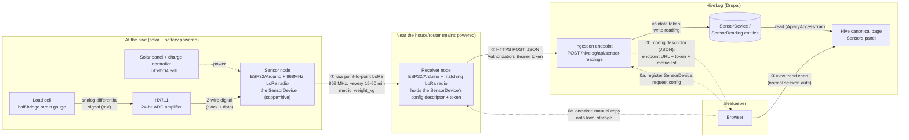

# Project: Automated sensor data collection

## Goal
Move HiveLog beyond manual record-keeping by accepting continuous,
automated readings (weight, temperature, humidity, and — later —
additional metrics) from physical sensor hardware, without locking the
module to any single vendor's sensors, radio protocol, or cloud platform.
Confirmed direction: an open, self-built platform, not a commercial
vendor's stack, built from mostly off-the-shelf components against a
defined extensibility contract, and powered entirely by renewable
energy at the apiary itself. See [[0074-sensor-data-ingestion-architecture]]
(accepted) for the data model, API, and device-provisioning mechanism,
[[0075-sensor-hardware-and-connectivity-selection]] (accepted) for the
hardware/protocol recommendation, [[0095-renewable-power-for-apiary-equipment]]
(accepted) for the solar/battery power constraint, and
[[0097-hardware-infrastructure-and-component-catalog]] (accepted) for
the standard-interface extensibility framework and real, current
off-the-shelf component catalog — required, per explicit direction,
before any physical hardware task proceeds.

## Scope
- In scope (Phase 1, per [[0074-sensor-data-ingestion-architecture]] §8):
  - `SensorDevice` entity (apiary- or hive-scoped, mirroring
    `CalendarAction.scope`) and `SensorReading` entity (time-series
    numeric readings), per-device bearer-token authentication.
  - One generic `POST /hivelog/api/sensor-readings` ingestion endpoint —
    transport-agnostic; LoRaWAN/WiFi/MQTT/Bluetooth are all bridge
    concerns outside HiveLog's own code.
  - A generated, downloadable device configuration descriptor (JSON:
    endpoint URL, bearer token, batching/interval hints, the allowed
    metric names) so firmware is flashed once, generically, and reused
    unchanged across every device — no per-device recompile, no secret in
    firmware source.
  - Numeric metrics only to start: `weight_kg`, `temp_internal_c`,
    `temp_external_c`, `humidity_internal_pct`, `humidity_external_pct`,
    `battery_voltage`, `signal_rssi`.
  - A read-only "Sensors" panel on the hive/apiary canonical pages
    (latest reading per metric + a daily-rollup trend chart, extending the
    existing inline-SVG weight-histogram pattern rather than adding a
    charting-library dependency).
  - A pilot build per [[0075-sensor-hardware-and-connectivity-selection]]:
    a load-cell weight sensor on an ESP32/Arduino, point-to-point raw
    LoRa to a WiFi-bridged receiver, for one hive.
  - The sensor node runs on solar + battery, not mains or disposable
    batteries — per [[0095-renewable-power-for-apiary-equipment]]. The
    receiver stays on ordinary mains power (sited at the house, out of
    that ADR's "at/around the apiary" scope).
  - The standing extensibility contract every future hardware addition
    is checked against, per [[0097-hardware-infrastructure-and-component-catalog]]:
    I2C for environmental sensors, 1-Wire for probe-style temperature,
    HX711's fixed 2-wire interface for weight, JST-PH 2.0mm for
    battery/solar power. A part that doesn't fit one of these is a
    signal to look for a more standard part first.
- In scope (Phase 2+, sequenced but not yet broken into tasks):
  1. Dashboard "Needs attention" integration — device-offline, sudden
     weight-drop, and out-of-range-temperature alerts, feeding the
     existing merged-alert-passes queue
     ([[0057-dashboard-information-architecture]]) alongside the seasonal
     calendar and low-stock inventory passes.
  2. The retention/rollup cron job (raw readings capped to a rolling
     window, e.g. 2 years, with a daily min/max/avg rollup surviving
     past it) — required before general rollout, not before a small
     pilot.
  3. Move from point-to-point raw LoRa to true LoRaWAN via The Things
     Network once a second apiary or an out-of-WiFi-range site needs
     covering. If that new site has no mains-powered site and no
     public/community gateway coverage, a dedicated off-grid gateway's
     power design is [[0096-off-grid-gateway-power-design]] — not
     triggered yet.
- Out of scope (for now):
  - Acoustic sensing (pre-swarm/queenless detection) — needs edge signal
    processing HiveLog does not do; no `SensorEvent`-style entity is
    designed yet, deliberately, since speccing one without a reference
    implementation would be guessing.
  - Chemical (VOC/VSC) sensing — flagged by the sources reviewed as the
    least mature of the modalities discussed.
  - Any commercial vendor's proprietary platform (Arnia, BroodMinder,
    Nectar, ...) as the primary integration path — the generic ingestion
    contract could accept a vendor's data too if one ever exposes
    outbound webhooks, but that's a possible future adapter, not this
    project's starting point.
  - Self-hosted LoRaWAN network server (ChirpStack) — a later option if
    TTN's fair-use ceiling or coverage becomes a real constraint, not a
    starting requirement.
  - Forecasting/anomaly ML — Phase 2's alerts are fixed thresholds,
    consistent with the module's existing "simple, explainable rules"
    style (the seasonal calendar is a fixed week window, not a predictive
    schedule either). Multi-signal, AI-synthesised recommendations
    ("add a super," "inspect — swarm risk," "all clear") are a distinct,
    later initiative — tracked separately as
    [[ai-apiary-insights]] ([[0083-ai-assisted-apiary-insights]],
    proposed and deliberately under-specified), not bundled into this
    project's own Phase 2 alerts.

## Architecture (Phase 1 pilot — one hive, weight only)
The minimal component set from [[0074-sensor-data-ingestion-architecture]]
and [[0075-sensor-hardware-and-connectivity-selection]], narrowed to
exactly what "measure and report the weight of one hive" needs — no
temperature/humidity, no second apiary, no true LoRaWAN gateway. Solid
arrows are the recurring telemetry path (runs every 15–60 minutes once
provisioned); dashed arrows are the one-time provisioning step that has
to happen before any telemetry can flow at all.



Steps 0a–0c happen once, when the device is first set up (or whenever its
token is regenerated); steps ①–③ are the recurring, unattended cycle.
Nothing here needs a LoRaWAN gateway, a network server account, or
temperature/humidity hardware — those are later, out-of-scope additions
per the Scope section above. The dashed power link into the sensor node
is the only equipment in this diagram [[0095-renewable-power-for-apiary-equipment]]
actually constrains — the receiver sits at the house, already on mains,
outside that ADR's "at/around the apiary" scope.

## Tasks
```dataview
TABLE status, priority
FROM #hivelog/task
WHERE contains(string(project), this.file.name)
SORT status asc, priority asc
```
Static index (in execution order):
- [[0076-sensor-device-and-reading-entities]] — backlog (do first;
  everything else depends on it)
- [[0077-sensor-ingestion-endpoint-and-device-auth]] — backlog
- [[0078-sensor-device-configuration-descriptor]] — backlog
- [[0079-pilot-weight-sensor-hardware-build]] — backlog (the real-hardware
  proof; no PHP test-suite deliverable of its own)
- [[0080-hive-apiary-sensors-panel]] — backlog
- [[0081-sensor-needs-attention-alerts]] — backlog
- [[0082-sensor-reading-retention-and-rollup]] — backlog, low priority
  (not required for the Phase 1 pilot; required before general rollout)
- [[0096-off-grid-gateway-power-design]] — backlog, low priority,
  **not yet triggered** — only becomes relevant once the Phase 2/3
  LoRaWAN scale-out trigger (item 3 above) actually happens, and even
  then only if no mains-powered site or public gateway coverage exists
  at the new location.

**Added 2026-09-22**, caught during manual UI validation ahead of
[[ai-apiary-insights]]'s own [[0094-ai-insights-prelaunch-validation]]
gate — a real, previously-untracked gap: `SensorDevice` has never had
an add/edit UI, and none of `nanoprobe`/`collective`/`nexus` are
reachable from the site's navigation at all.
- [[0105-submodule-navigation-menu-links]] — **done** (2026-09-22):
  grew mid-task into a theme-independent in-app secondary nav
  (`hook_hivelog_app_nav_items()`, `HivelogAppNavBuilder`) after manual
  verification found `cms2`'s active theme renders none of
  `hivelog.links.menu.yml`'s existing links either — the menu-link files
  for `collective`/`nexus` stay too, as a best-effort secondary
  integration. `nanoprobe`'s own nav item is still deferred to 0106,
  since there's no `SensorDevice` collection route to point it at yet.
- [[0106-sensor-device-management-ui]] — **done** (2026-09-22): the
  actual blocker for a beekeeper self-provisioning any sensor at all —
  task 0078 explicitly deferred this and no follow-up task ever existed
  until now. `SensorDevice` gained the standard add/edit/delete/
  collection handlers (mirroring `ApiClient`), a scope-conditional
  `hive` field (`#states`, matching `AiProviderConfigForm`'s `mode`
  pattern), contextual add routes pre-filling apiary/hive from a Hive/
  Apiary canonical page's new "Add Sensor" link, and folded in
  `nanoprobe`'s own `hook_hivelog_app_nav_items()`/menu-link
  contribution per 0105. The long-unused `add sensor device` permission
  was removed as dead config rather than wired in — `administer
  hivelog` is the only way to create one, matching `ApiClient`/
  `AiProviderConfig`.
- [[0107-assimilate-mock-sensor-data-module]] — **done** (2026-09-22):
  a dev/demo-only module provisioning its own demo apiary/hive/sensor
  devices (weight + temperature_humidity) plus one demo inspection
  (needed since `HiveContextBuilder` is sensor-less by design —
  [[0085-sensor-less-insight-prototype]] — so nexus has real inspection
  context to reason over, not just sensor readings), then generating a
  believable random-walk trend of new `SensorReading` rows on every
  cron run. Guards against production contamination via
  `hook_requirements()`'s `install`-phase `REQUIREMENT_ERROR` (refuses
  to install if any real apiary already has AI insights enabled) plus a
  live re-check on every `assimilate_cron()` run. Verified live: the
  Sensors panel, dashboard, and `nexus_cron()` all picked up the demo
  data exactly like real data.
- [[0108-custom-controller-table-styling-parity]] — **done** (2026-09-22):
  `ApiClientController`/`AiProviderConfigController`/`SensorDeviceController`'s
  bare summary tables now match every other custom controller's styled
  `hivelog-*-table` convention
- [[0110-hive-apiary-stat-tiles]] — **done** (2026-09-22): the dashboard's
  own `hivelog:stat-tile` row now also appears on the Hive/Apiary
  canonical pages — an AI Insight tile (nexus) and one tile per sensor
  device (nanoprobe), via two new core hooks
  (`hook_hivelog_hive_stat_tiles()`/`hook_hivelog_apiary_stat_tiles()`)
  mirroring 0105's own app-nav descriptor pattern. Sensor tiles link to
  a brand-new full-history readings page
  (`entity.sensor_device.readings`), filterable by metric/date range —
  the first collection route `SensorReading` has ever had. Same-day
  follow-up: the dashboard's own "AI Insights" section (`/hivelog`,
  owned by [[ai-apiary-insights]]) got the same tile treatment — see
  that project's own notes.
- [[0111-hive-page-declutter-dedicated-insights-page]] — **done**
  (2026-09-22): with the stat tiles from 0110 giving a compact preview,
  the Hive canonical page's full AI Insight and Sensors panels moved to
  a new dedicated `entity.hive.insights` page
  (`/hivelog/hive/{hive}/insights`), via a second, page-specific core
  hook (`hook_hivelog_hive_insights_panels()`) — the Apiary canonical
  page's own copies of both panels are unchanged, scoped to just the
  page the user named.

## Open questions
- Exact alert thresholds for Phase 2 (how large a weight drop, how far
  outside 33–36 °C, how stale a `last_seen`) are illustrative in the ADR,
  not finalised — worth a real check against actual sensor noise once
  Phase 1 data exists, rather than guessed now.
- Config-descriptor file format on-device (SPIFFS/LittleFS vs SD card)
  is a firmware choice left to whoever builds the pilot node — not
  decided here since it doesn't affect HiveLog's own side of the
  contract.

## Related decisions
- [[0074-sensor-data-ingestion-architecture]] (accepted — entities, API,
  device auth + config-descriptor provisioning, retention policy,
  dashboard integration)
- [[0075-sensor-hardware-and-connectivity-selection]] (accepted —
  protocol/hardware recommendation)
- [[0095-renewable-power-for-apiary-equipment]] (accepted — solar/battery
  power constraint on the sensor node; flags the harder gateway-class
  case for any future phase that needs a dedicated, off-grid LoRaWAN
  gateway)
- [[0097-hardware-infrastructure-and-component-catalog]] (accepted — the
  standard-interface extensibility contract, a real market survey of
  current off-the-shelf components, and the corrected power-component
  pairing for [[0095-renewable-power-for-apiary-equipment]])
- [[0003-code-defined-entity-schema]] (baseFieldDefinitions + update
  hooks pattern reused for both new entities)
- [[0004-custom-controllers-over-view-builders]] (the ingestion route and
  any Sensors-panel rendering)
- [[0006-contrib-dependency-policy]] (why device auth is a small custom
  mechanism, not a contrib OAuth module)
- [[0018-csrf-and-safe-http-methods]] (why the ingestion route's
  bearer-token auth is a reasoned exception to session CSRF, not a bare
  unprotected mutation)
- [[0019-authorisation-model]] / [[0020-access-parity-custom-routes]]
  (reading sensor data back out follows the normal apiary-scoped model
  unchanged)
- [[0022-authentication-and-membership]] (this project is the "future ADR"
  that decision explicitly deferred to)
- [[0025-seasonal-calendar-and-hive-action-tracking]] (the apiary/hive
  `scope` duality `SensorDevice` reuses)
- [[0057-dashboard-information-architecture]] (the "Needs attention"
  merged-alert-passes queue Phase 2 feeds into)
