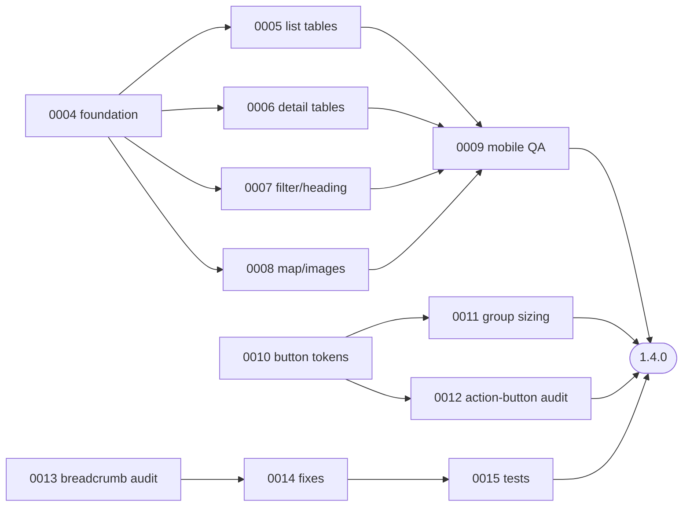

# 🐝 Hivelog Roadmap
A living roadmap derived from the projects, tasks, decisions, and releases in
this vault. Sequencing is driven by dependencies and completed work rather than
fixed dates. Last refreshed **2026-06-25**.

## Release timeline
### ✅ Released
- **1.1.0** — Refactor button rendering to use SDC `button` and `button-group` components. See [[1.1.0]].
- **1.2.0** — Fix uninstall when database tables are missing. See [[1.2.0]].
- **1.3.0** — Move geofield Drupal 11 patches into the module. See [[1.3.0]].

### 🚧 In progress — 1.4.0 (consistency & mobile)
Release note: [[1.4.0]]
- [[mobile-ux-improvements]] — active; `0004`–`0008` done, [[0009-mobile-qa-and-tap-targets]] remains.
- [[action-button-consistency]] — planning; [[0010-define-button-tokens-and-source-of-truth]] is queued (todo).
- [[breadcrumb-consistency]] — planning; [[0013-breadcrumb-route-audit]] is queued (todo).

### 📋 Unassigned release
- [[queen-observation-enhancements]] — [[0001-queen-observation-csv-export]] remains `in-progress`; [[0002-breadcrumb-queen-canonical]] is already satisfied in code and has been closed in the vault.
- [[0003-apiary-map-marker-clustering]] — `backlog` (low); revisit as a future map-UX initiative.
- **GitHub Actions CI** — [[0016-implement-github-actions-ci]] (`todo`, high priority); decision [[0023-github-actions-ci-pipeline]] accepted. No schema changes; candidate for inclusion in 1.4.0 or as a standalone infrastructure release.

## Decision gate
**Decision gate cleared: 23 accepted · 0 proposed.**

The foundation ADRs for the current work are already accepted and no longer
block execution:
- [[0011-responsive-design-strategy]] → implemented by [[0004-responsive-foundation-and-breakpoints]]
- [[0012-action-button-design-system]] → guides [[0010-define-button-tokens-and-source-of-truth]]
- [[0013-breadcrumb-policy]] → guides [[0013-breadcrumb-route-audit]]

## Critical path (1.4.0)


## Recommended sequence
1. Finish the button-system foundation in [[0010-define-button-tokens-and-source-of-truth]].
2. Land [[0011-unify-button-group-sizing]] and [[0012-audit-action-buttons-across-pages]].
3. Run [[0013-breadcrumb-route-audit]] now that [[0002-breadcrumb-queen-canonical]] is closed as already implemented.
4. Apply any resulting breadcrumb fixes/tests in [[0014-implement-breadcrumb-consistency-fixes]] and [[0015-breadcrumb-test-coverage]].
5. Complete [[0009-mobile-qa-and-tap-targets]] as the mobile QA gate.
6. Cut **1.4.0** using the [[0010-semantic-versioning-and-releases]] checklist.

## Live snapshot — open tasks by project
```dataview
TABLE status, priority, project
FROM #hivelog/task
WHERE status != "done" AND status != "dropped"
SORT project asc, file.name asc
```

## Related
- Dashboard: [[index]]
- Conventions: [[README]]
