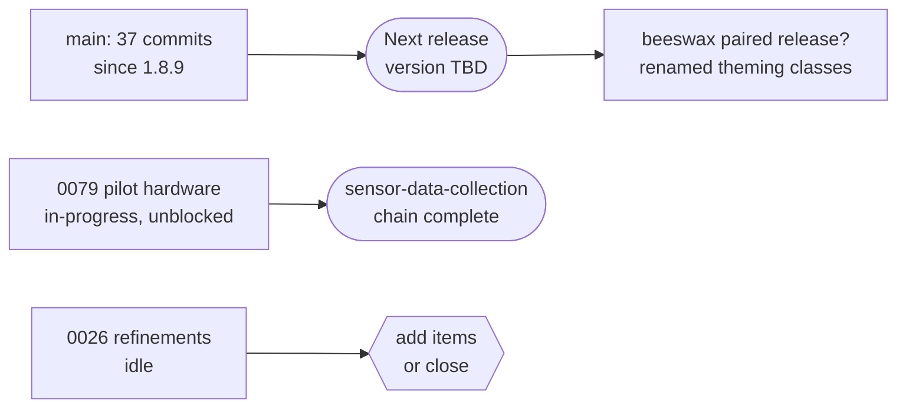

# 🐝 Hivelog Roadmap
A living roadmap derived from the projects, tasks, decisions, and releases in
this vault. Sequencing is driven by dependencies and completed work rather than
fixed dates. Last refreshed **2026-09-26**.
## Where things stand
131 tasks: **116 done**, 2 in-progress, 12 backlog, 1 dropped — no task is in
`todo` or `review`. 13 projects: **8 done**, 4 active, 1 dropped. 43
decisions: 42 accepted, 1 proposed.
The near-term question is not what to build next but **what to release**: 37
commits have landed on `main` since the 1.8.9 tag, including two security
fixes, and none of them has shipped.
## Release timeline
### ✅ Released
17 versions, 1.1.0 through **1.8.9** (the latest tag, and the version in
`hivelog.info.yml`). Each has its own note in `releases/`.
### 📦 Unreleased on `main`
Everything from the 2026-09-23 navigation and page-structure reviews, plus the
delete-policy work. No version has been chosen yet. In rough order of
significance:
- **Security (ship these first).** [[0133-route-level-entity-access]] closed an
  IDOR — no hivelog route except one checked per-entity access, so "own"-only
  permissions passed for another user's apiary or hive on view, edit, delete
  and Insights. [[0124-list-page-row-access-filter]] stopped collection pages
  listing other users' rows.
- **Delete policy** ([[0103-delete-policy-for-records-with-children]]).
  [[0134-delete-dependency-framework]] plus the four treatment tasks
  ([[0141-delete-block-relationships]], [[0142-delete-cascade-owned-records]],
  [[0143-delete-detach-optional-references]],
  [[0144-delete-warn-historical-references]]) cover all 28 relationships, and
  [[0145-orphan-report-and-cleanup-command]] adds `drush hivelog:orphans` for
  the orphans existing sites already carry (1,024 calendar actions and 9
  inventory items on `cms2`).
- **Page structure.** One shared implementation per page kind:
  [[0125-shared-detail-page-builder]], [[0126-unified-list-page-base]] (which
  also fixed a silent 50-row cutoff), [[0127-shared-delete-form-base]],
  [[0128-page-heading-hierarchy]], [[0129-cancel-link-on-add-edit-forms]],
  [[0131-single-detail-table-css-class]],
  [[0132-filters-on-hive-inspection-observation-lists]].
- **Navigation.** [[0116-breadcrumb-builder-parent-map-refactor]],
  [[0117-breadcrumb-terminal-crumb-on-form-pages]],
  [[0118-page-owned-edit-delete-then-retire-local-tasks]],
  [[0119-single-source-navigation-registry]],
  [[0120-app-nav-active-state-and-grouping]],
  [[0121-reachability-of-orphaned-collection-pages]],
  [[0122-top-level-entity-breadcrumb-threading]].
- **Housekeeping.** [[0135-submodule-create-permissions]],
  [[0136-missing-collection-link-templates]],
  [[0137-align-lint-static-analysis-and-test-gates]],
  [[0138-refresh-agents-md]], [[0139-submodule-packaging-hygiene]],
  [[0123-refresh-navigation-reference-docs]],
  [[0140-controller-and-form-test-gaps]],
  [[0130-shared-calendar-checklist-helpers]].
Note that [[0131-single-detail-table-css-class]] renames theming-API class
names, and [[0118-page-owned-edit-delete-then-retire-local-tasks]] deletes
`hivelog.links.task.yml` / `hivelog.links.action.yml`. Both affect the surface
[[0060-visual-identity-in-site-theme]] asks themes to rely on, so the version
choice should follow [[0010-semantic-versioning-and-releases]] deliberately
rather than by default — and **beeswax** (`deburca/beeswax`) may need a
matching release.
## Active projects
- **[[sensor-data-collection]]** — 13 tasks done. The software chain ships;
  what's left is physical. [[0079-pilot-weight-sensor-hardware-build]] is
  `in-progress` and is the only substantive non-release task ready to pick up
  — its stale `blocked-by` (naming the already-`done`
  [[0078-sensor-device-configuration-descriptor]]) has been cleared. Backlog:
  [[0096-off-grid-gateway-power-design]],
  [[0115-varroa-camera-sensor-hardware-build]].
- **[[seasonal-calendar-and-hive-action-tracking]]** — all 11 build tasks done,
  including [[0027-apiary-vs-hive-scoped-calendar-items]] (the `ApiaryActionLog`
  work an earlier roadmap listed as "designed but not started"). Only the
  umbrella [[0026-post-testing-refinements]] is open; its single recorded item
  is done, so it is idle until more hands-on feedback arrives — worth either
  adding items or closing.
- **[[inventory-and-yield-improvements]]** — 8 done, 7 in backlog
  ([[0046-real-sales-ledger]], [[0047-cross-apiary-aggregate-views]],
  [[0048-unit-conversion]], [[0050-fifo-lot-costing]],
  [[0051-expected-unit-price-audit-trail]],
  [[0052-merge-usage-and-yield-form-traits]],
  [[0053-product-category-field]]). All `low` priority; the sales ledger is the
  one that would unlock true profitability rather than potential income.
- **[[ai-apiary-insights]]** — 14 done across `collective`, `nexus` and the
  dashboard. [[0094-ai-insights-prelaunch-validation]] remains in backlog and
  is the gate before pointing this at real beekeepers.
## Completed projects
[[mobile-ux-improvements]], [[action-button-consistency]],
[[breadcrumb-consistency]], [[page-structure-consistency]],
[[dashboard-landing-page]], [[hivelog-visual-identity]],
[[inventory-tracking-and-depreciation]] and
[[honey-wax-propolis-yield-and-potential-income]] are all `done`.
## Dropped projects
**[[queen-observation-enhancements]]**, 2026-09-26. Its only undelivered goal
(CSV export, [[0001-queen-observation-csv-export]]) was judged unnecessary on
review and dropped; its other task
([[0002-breadcrumb-queen-canonical]]) was already satisfied by existing code.
## Decision gate
**42 accepted · 1 proposed.** Nothing blocks execution.
[[0057-dashboard-information-architecture]] and
[[0060-visual-identity-in-site-theme]] were accepted in body `## Status` all
along but were missing the `status:` frontmatter field Dataview reads — now
added.
The one proposed ADR is [[0083-ai-assisted-apiary-insights]], deliberately
under-specified as a future-phase umbrella. It has since been overtaken in
practice: [[0100-nexus-in-process-ai-synthesis]] records it as *partially*
superseded, and the insights feature shipped via
[[0087-ai-insights-hosting-and-privacy-model]] /
[[0088-ai-insights-implementation]] / ADR-0100. Worth deciding whether it
should now read `superseded`.
## Unassigned tasks
Two backlog tasks belong to no project: [[0003-apiary-map-marker-clustering]]
(a future map-UX initiative) and
[[0055-embed-required-items-and-expected-yield-in-calendar-action-edit-form]].
## Recommended sequence
1. Choose the version for the unreleased batch and cut the release, following
   [[0010-semantic-versioning-and-releases]]. The two security fixes argue
   against sitting on it. Check whether **beeswax** needs a paired release for
   the renamed theming classes.
2. Finish [[0079-pilot-weight-sensor-hardware-build]] — unblocked now that its
   stale `blocked-by` is cleared — the last step in
   [[sensor-data-collection]]'s original chain.
3. Decide the fate of the idling [[0026-post-testing-refinements]] umbrella
   task — add another item or close it.
4. Re-status [[0083-ai-assisted-apiary-insights]], then run
   [[0094-ai-insights-prelaunch-validation]] before any real-world AI rollout.
5. Pick up [[inventory-and-yield-improvements]]' backlog only when a real need
   surfaces — every item there is `low` and speculative.
## Current state

## Live snapshot — open tasks by project
```dataview
TABLE status, priority, project
FROM #hivelog/task
WHERE status != "done" AND status != "dropped"
SORT project asc, file.name asc
```
## Related
- Dashboard: [[index]]
- Conventions: [[README]]
