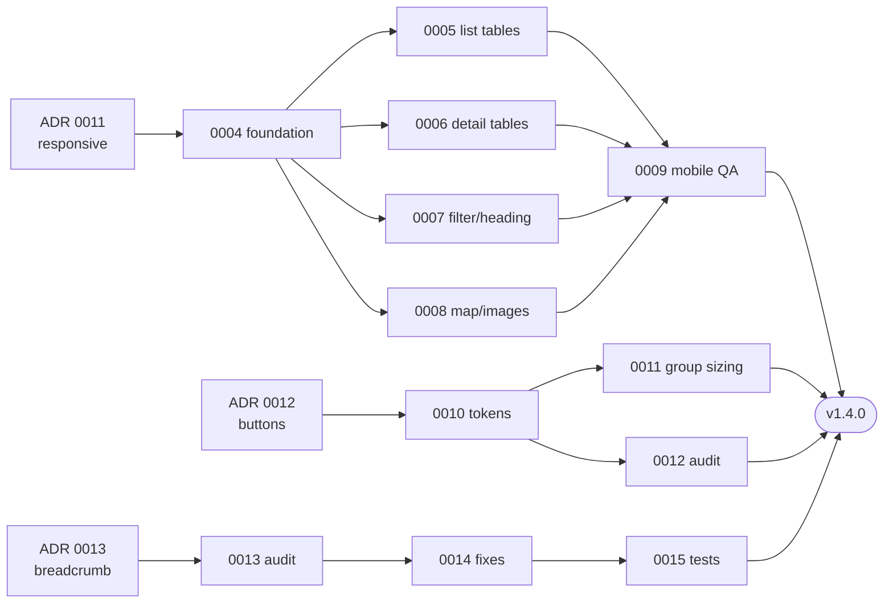

# 🐝 Hivelog Roadmap
A living roadmap derived from the projects, tasks, decisions, and releases in
this vault. Sequencing is driven by decision approvals (ADRs) and dependencies,
not fixed dates. Last refreshed **2026-06-17**.

## Release timeline
### ✅ Released
- **1.3.0** — Move geofield Drupal 11 patches into the module (#79).
- **1.2.0** — Fix uninstall when database tables are missing (#77).

### 🚧 In progress — Queen observation enhancements
Project: [[queen-observation-enhancements]]
- [[0001-queen-observation-csv-export]] — `in-progress` (high)
- [[0002-breadcrumb-queen-canonical]] — `todo` (medium); the breadcrumb builder
  already threads queen ancestry, so this is likely **already implemented** —
  confirm and close via [[0013-breadcrumb-route-audit]].
> ⚠️ Numbering: the existing [[v1.1.0]] release note predates the shipped
> `1.2.0` / `1.3.0` tags. Renumber the next release (this work lands above
> `1.3.0`) per [[0010-semantic-versioning-and-releases]].

### 🗓️ Planned — v1.4.0 (consistency & mobile)
Three planning-stage projects, each gated on its foundation ADR (see Decision
gate below):
- [[mobile-ux-improvements]] — tasks `0004`–`0009`
- [[action-button-consistency]] — tasks `0010`–`0012`
- [[breadcrumb-consistency]] — tasks `0013`–`0015`

### 🧊 Unscheduled
- [[0003-apiary-map-marker-clustering]] — `backlog` (low); revisit as a future
  "Map UX" initiative.

## Decision gate
**7 accepted · 15 proposed.** The v1.4.0 foundations cannot start until their
backing decisions are approved:
- [[0011-responsive-design-strategy]] → unblocks [[0004-responsive-foundation-and-breakpoints]] → whole mobile project
- [[0012-action-button-design-system]] → unblocks [[0010-define-button-tokens-and-source-of-truth]]
- [[0013-breadcrumb-policy]] → unblocks [[0013-breadcrumb-route-audit]]

High-impact **security** decisions to prioritise (imply schema/settings changes,
so approve early): [[0016-uploaded-image-security]], [[0015-apiary-location-privacy]].

Proposed ADRs still awaiting approval:
```dataview
LIST
FROM #hivelog/decision
WHERE status = "proposed"
SORT file.name asc
```

## Critical path (v1.4.0)


## Recommended sequence
1. Approve the foundation ADRs `0011`, `0012`, `0013` (+ security `0015`, `0016`).
2. Promote foundations [[0004-responsive-foundation-and-breakpoints]],
   [[0010-define-button-tokens-and-source-of-truth]],
   [[0013-breadcrumb-route-audit]] from `backlog` → `todo`.
3. Mobile per-page tasks (`0005`–`0008`) → QA gate [[0009-mobile-qa-and-tap-targets]].
4. Button [[0011-unify-button-group-sizing]] + [[0012-audit-action-buttons-across-pages]];
   breadcrumb [[0014-implement-breadcrumb-consistency-fixes]] + [[0015-breadcrumb-test-coverage]].
5. Cut **v1.4.0** using the [[0010-semantic-versioning-and-releases]] checklist.

## Live snapshot — open tasks by project
```dataview
TABLE status, priority, project
FROM #hivelog/task
WHERE status != "done" AND status != "dropped"
SORT project asc, file.name asc
```

## Related
- Dashboard: [[index]]
- Conventions: [[README]]
