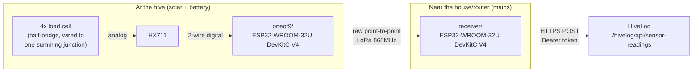

# HiveLog pilot sensor hardware

Firmware and wiring reference for
[task 0079](../docs/project-management/tasks/0079-pilot-weight-sensor-hardware-build.md)
— the first real, physical `SensorDevice`: a solar/battery-powered
weight-sensor node talking raw point-to-point LoRa to a mains-powered
receiver, which bridges onto HiveLog's ingestion endpoint. See
[ADR-0074](../docs/project-management/decisions/0074-sensor-data-ingestion-architecture.md)
(ingestion contract) and
[ADR-0075](../docs/project-management/decisions/0075-sensor-hardware-and-connectivity-selection.md)
(hardware/protocol choice) for the design this implements.

Deliberately **not** part of the `hivelog` Drupal module itself — this is
firmware (C++, PlatformIO), a different language and build toolchain
entirely, kept in this repo only because task 0079 didn't require a
separate one for a solo-maintainer pilot.

## Two boards, two roles



- **`oneof9/`** — battery/solar powered, deep-sleeps between
  readings, no WiFi. Reads the load cells via HX711, reads its own
  battery voltage, sends both over raw LoRa, sleeps again. Never talks
  to HiveLog directly.
- **`receiver/`** — mains powered, WiFi-connected. Listens for LoRa
  packets, reads its own signal strength (RSSI), and POSTs a batch of
  three readings (`weight_kg`, `battery_voltage`, `signal_rssi`) to
  HiveLog using a bearer token it reads from a locally stored
  configuration file — never hardcoded in firmware source.

## Wiring

### Sensor node

| Signal | ESP32 pin | Notes |
|---|---|---|
| HX711 DOUT | GPIO 16 | |
| HX711 SCK | GPIO 17 | |
| LoRa SCK | GPIO 5 | Shared SPI bus |
| LoRa MISO | GPIO 19 | |
| LoRa MOSI | GPIO 27 | |
| LoRa NSS/CS | GPIO 18 | |
| LoRa RST | GPIO 14 | |
| LoRa DIO0 | GPIO 26 | |
| Battery voltage sense | GPIO 34 | Via a 1:1 resistor divider (e.g. 100kΩ + 100kΩ) from the cell's raw terminal voltage — halves it to stay safely under the ADC's ~3.3V ceiling. |
| Power | LiFePO4 cell → **3V3 pin directly** | **Not 5V/VIN** — see task 0079's voltage-compatibility notes for why. |

All pin numbers are `#define`s at the top of `oneof9/src/main.cpp` —
adjust there if the actual build wires differently.

**Required hardware step, not a firmware setting**: desolder the DevKitC
board's onboard power LED before field deployment. It draws quiescent
current a bare module wouldn't, which matters on a battery/solar budget;
the receiver's copy of the same board is mains-powered and doesn't need
this.

**Four load cells, one HX711**: the four half-bridge load cells are
wired into a single summing junction (per task 0079's weatherproofing
notes — this junction gets its own small IP65 box near the load cell),
producing one combined bridge signal into one HX711. The firmware reads
a single channel; there is no per-cell code.

### Receiver

Same LoRa pin map as the sensor node (SCK 5 / MISO 19 / MOSI 27 / NSS 18
/ RST 14 / DIO0 26) — both ends of a raw point-to-point link must agree
on radio wiring, since there's no negotiation step to fall back on if
they don't. No load cell, no battery — plugged into mains via USB, on
WiFi.

## Calibration

The HX711 reading is arbitrary raw counts until calibrated against a
known weight:

1. Flash `oneof9/` with `CALIBRATION_FACTOR = 1.0` and
   `TARE_OFFSET = 0.0` (the placeholders) and watch the serial monitor —
   note the raw reading with nothing on the load cells (this is your
   `TARE_OFFSET`).
2. Place a known test weight (e.g. 5kg) on the load cell stand and note
   the new raw reading.
3. `CALIBRATION_FACTOR = (raw_with_weight - TARE_OFFSET) / known_weight_kg`.
4. Repeat with a second known weight if possible and average, for a
   better fit across the load cells' actual response.
5. Update both constants in `oneof9/src/main.cpp` and reflash.

This is a per-physical-build calibration — a different set of load
cells, or reseating/rewiring the summing junction, needs recalibrating.

## Building and flashing

Both firmwares are [PlatformIO](https://platformio.org) projects.

```bash
cd hardware/oneof9
pio run --target upload
cd hardware/receiver
cp src/secrets.h.example src/secrets.h   # fill in real WiFi credentials
pio run --target upload
```

`secrets.h` is gitignored — never commit real WiFi credentials.

## Provisioning a device

1. In HiveLog, register a `SensorDevice` (`scope: hive`, `device_type:
   weight`, `transport: lorawan`) against the real test hive — see
   [task 0078](../docs/project-management/tasks/0078-sensor-device-configuration-descriptor.md).
2. On the device's canonical page, use "Download Configuration" — this
   also regenerates the device's token, so do this once, right before
   provisioning, not speculatively in advance.
3. Copy the downloaded JSON file onto the **receiver** board's
   filesystem as `/config.json` (the sensor node never sees this file —
   it has no WiFi/filesystem access and doesn't need the token; only the
   receiver authenticates to HiveLog). With PlatformIO:
   ```bash
   pio run --target uploadfs   # after placing the file in receiver/data/config.json
   ```
   (create a `receiver/data/` directory containing the downloaded file,
   renamed to `config.json`, before running this — PlatformIO's
   filesystem upload packages everything under `data/`).
4. Power on both boards. The receiver's serial monitor should show
   `Loaded config for endpoint: ...`; the sensor node's serial monitor
   (while still connected over USB, before final deployment) should show
   a weight/battery reading and a LoRa send on each wake.

## Known simplifications (Phase 1 pilot, not gaps to silently accept forever)

- The receiver skips TLS certificate validation (`WiFiClientSecure::
  setInsecure()`) rather than pinning a CA certificate — real added
  firmware complexity not justified for a single-hive pilot against a
  self-hosted site. Revisit before a wider rollout.
- Neither board retries or queues a failed send — a dropped LoRa packet
  or a failed HTTPS POST is logged and discarded, not retried. A
  persistent gap shows up as `SensorDevice.last_seen` going stale, which
  is the intended signal per
  [ADR-0074 §7](../docs/project-management/decisions/0074-sensor-data-ingestion-architecture.md).
- `recorded` timestamps come from the **receiver's** NTP-synced clock at
  the moment it receives each LoRa packet, not from the sensor node
  (which has no RTC or network access). At a 15–60 minute sampling
  interval, the few seconds of LoRa transmission latency this introduces
  is immaterial.
